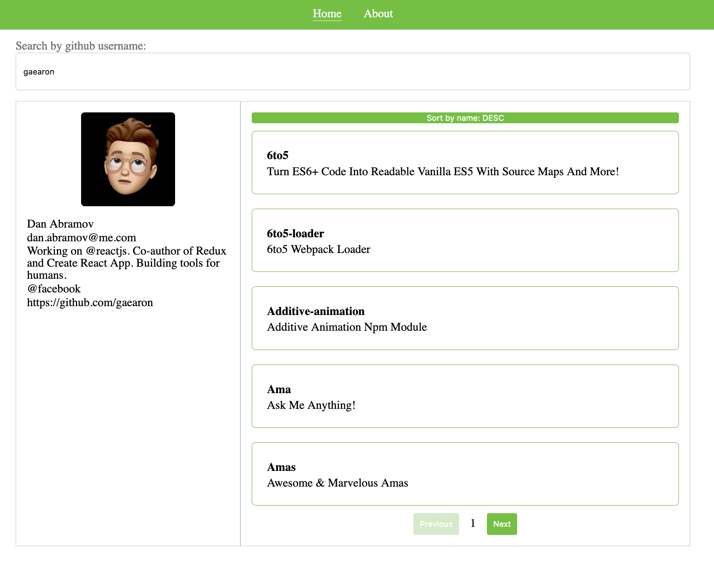

#### Github search

#### How to run

-   git clone https://gitlab.com/erkidhoxholli/rimac-react
-   cd ./rimac-react
-   rename `.env.example` to `.env`
-   [generate github token](https://docs.github.com/en/github/authenticating-to-github/creating-a-personal-access-token)
-   replace `YOUR_TOKEN` in `.env` with the one you generated from github
-   `yarn`
-   `yarn dev`

#### Technologies
-   React 
-   GraphQL 
-   Typescript
> Everything is built from the ground up!

#### Recommended improvements
-   add "strict": true in tsconfig and fix errors
-   search/pagination improvements and refactoring
-   adding support for yarn private workspaces (create design-system)
-   finish up a proper useQuery implementation for graphql