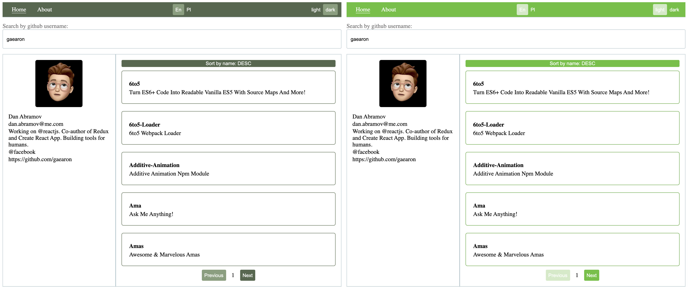

#### How to run
-   git clone https://github.com/erkidhoxholli/rtpw.git
-   cd ./rtpw
-   rename `.env.example` to `.env`
-   [generate github token](https://docs.github.com/en/github/authenticating-to-github/creating-a-personal-access-token)
-   replace `YOUR_TOKEN` in `.env` with the one you generated from github
-   `yarn`
-   `yarn dev`

#### Features:
-   Use as a boilerplate
-   Theming 
-   Internationalization 
-   Scalable structure

#### Screenshots

#### Technologies
-   React 
-   GraphQL 
-   Typescript
> Everything is built from the ground up!

#### Recommended improvements
-   design-system and hook-form packages
-   add proper e2e and unit tests
-   add CircleCI support
